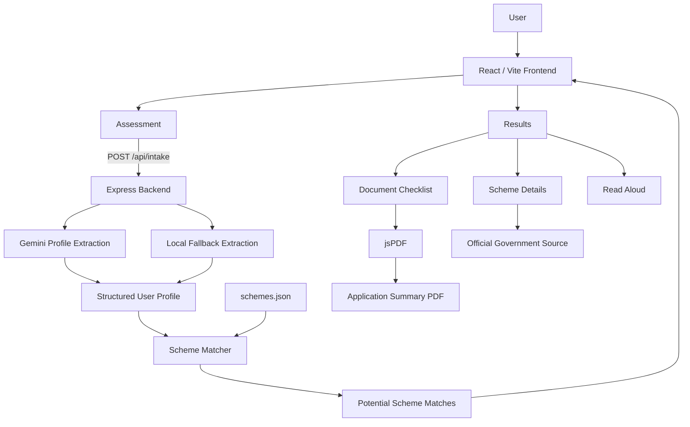

# Sahayak

**Sahayak** is a multilingual, voice-friendly government benefit
discovery platform that helps people identify government schemes that
may match their situation. Users describe their circumstances in natural
language, Sahayak extracts a structured profile, matches it against a
curated scheme dataset, explains why a scheme may match, identifies
relevant documents, and provides official sources and application
guidance.

> **Important:** Sahayak provides informational potential matches only.
> It does not make final eligibility decisions. Final eligibility and
> benefit approval are determined by the relevant government authority.

---

## 1. Project Overview

Finding government benefits can be difficult because eligibility rules,
required documents, and scheme information are spread across different
sources.

Sahayak simplifies the discovery process into a guided flow:

```text
Describe your situation
        ↓
Profile extraction
        ↓
Scheme matching
        ↓
Potential benefit matches
        ↓
Why it may match + document requirements
        ↓
Official source / next steps
        ↓
Application summary PDF
```

The application supports English and Hindi UI text and includes
browser-based voice input and read-aloud functionality.

---

## 2. Features

### Natural-language intake

Users can describe their situation in a sentence or paragraph instead of
filling out a long form.

### AI-assisted profile extraction

The backend uses the Gemini API to extract structured information such
as:

- Age
- Gender
- Marital status
- Location
- Monthly income
- Number of children
- Whether children are studying
- Student status
- Disability information
- Farmer/landholding information
- Household information

Only information explicitly provided by the user is intended to be
extracted.

### Local fallback extraction

If the Gemini API is unavailable or quota-limited, the backend uses a
local rule-based fallback for key profile fields so the demo can
continue without returning a hard-coded demo profile.

### Scheme matching

The backend matches the extracted profile against the project's scheme
dataset and returns potential matches with:

- Scheme name
- Match level
- Match score
- Reason for the potential match
- Matched conditions
- Missing information
- Document requirements
- Benefit information
- Official source URL

### Multilingual interface

The interface currently supports:

- English
- Hindi

### Voice input

The assessment flow can use the browser's Web Speech API to convert
spoken input into text.

### Read aloud

Scheme results can be read aloud using the browser's speech synthesis
functionality, with English/Hindi language selection.

### Document guidance

The application presents documents identified from the matched scheme
requirements and separately displays documents specifically marked as
missing by the backend.

### Application summary PDF

Users can generate a PDF summary containing the extracted profile,
matched scheme information, conditions, and document information.

### Responsive interface

The frontend is designed for desktop and mobile-sized screens.

---

## 3. Tech Stack

Technology Role

---

React Frontend application and UI components
Vite Frontend development/build tooling
JavaScript Application logic
Tailwind-style utility classes Responsive UI styling
Node.js Backend runtime
Express REST API server
Gemini API Natural-language profile extraction
JSON Scheme dataset and structured application data
Web Speech API Browser voice input
SpeechSynthesis API Browser read-aloud
jsPDF Application summary PDF generation
Git/GitHub Version control and collaboration

### Why this stack?

The architecture keeps the frontend and backend simple enough for a
hackathon while still separating presentation, API processing, AI
extraction, and scheme matching into distinct responsibilities.

The scheme data is stored as JSON rather than requiring a database for
the current prototype, which keeps local setup lightweight and makes the
matching layer easy to inspect and modify.

---

## 4. Architecture



### Component responsibilities

**Frontend** - Collects user input - Displays the profile summary -
Displays potential matches - Provides multilingual UI - Provides voice
input/read-aloud - Generates the application summary PDF

**Backend** - Receives natural-language intake requests - Extracts
structured profile information - Uses a local fallback when AI
extraction fails - Runs scheme matching - Returns structured results

**Scheme dataset** - Stores the scheme information used by the matcher -
Provides scheme requirements, document information, benefits, and
official URLs

---

## 5. Project Structure

```text
sahayak/
│
├── public/
│
├── src/
│   ├── assets/
│   ├── components/
│   ├── data/
│   ├── pages/
│   │   ├── Landing.jsx
│   │   ├── Assessment.jsx
│   │   ├── Profile.jsx
│   │   ├── Results.jsx
│   │   ├── SchemeDetails.jsx
│   │   └── Documents.jsx
│   │
│   ├── App.jsx
│   ├── App.css
│   ├── index.css
│   └── main.jsx
│
├── sahayak-backend/
│   ├── data/
│   │   └── schemes.json
│   ├── utils/
│   │   ├── gemini.js
│   │   └── matcher.js
│   ├── server.js
│   ├── package.json
│   └── .env                 # Local only; not committed
│
├── .gitignore
├── index.html
├── package.json
├── package-lock.json
├── vite.config.js
└── README.md
```

### Important files

---

File Responsibility

---

`src/App.jsx` Frontend page navigation and shared
application state

`src/pages/Assessment.jsx` User intake, questions, voice
input, backend request

`src/pages/Profile.jsx` Profile confirmation

`src/pages/Results.jsx` Potential scheme matches and
document overview

`src/pages/SchemeDetails.jsx` Detailed scheme information and
official source

`src/pages/Documents.jsx` Document checklist and PDF
generation

`sahayak-backend/server.js` Express server and API endpoints

`sahayak-backend/utils/gemini.js` Gemini profile extraction

`sahayak-backend/utils/matcher.js` Scheme matching logic

`sahayak-backend/data/schemes.json` Scheme dataset

---

---

## 6. Installation & Setup

### Prerequisites

Install:

- Node.js
- npm
- Git

A modern Chromium-based browser is recommended for browser voice
features.

### Clone the repository

```bash
git clone https://github.com/karthi-21-glh/sahayak.git
cd sahayak
```

### Frontend setup

From the project root:

```bash
npm install
```

### Backend setup

```bash
cd sahayak-backend
npm install
```

### Environment variable

Create:

```text
sahayak-backend/.env
```

Add your Gemini API key:

```env
GEMINI_API_KEY=your_gemini_api_key_here
# Optional; defaults to the model supported by the current Gemini account.
GEMINI_MODEL=gemini-3.5-flash-lite
# Optional; defaults to 3000.
PORT=3000
```

**Never commit `.env` or expose the API key publicly.**

The backend retries temporary Gemini rate-limit and availability errors before
using its local extraction fallback. A fallback response includes
`"used_fallback": true`.

The repository's `.gitignore` excludes the backend `.env` file and
dependency folders.

### Start the backend

From:

```text
sahayak/sahayak-backend
```

run:

```bash
node server.js
```

The backend runs on:

```text
http://localhost:3000
```

If the frontend or backend is running on another host or port, set
`VITE_API_BASE_URL` in the frontend environment (for example,
`VITE_API_BASE_URL=http://localhost:4000`) and set the backend `PORT`
accordingly.

### Start the frontend

Open another terminal and from the project root run:

```bash
npm run dev
```

Vite will display the local frontend URL, normally similar to:

```text
http://localhost:5173
```

### Local architecture

When running locally:

```text
Browser
   ↓
Vite frontend :5173
   ↓
Express backend :3000
   ↓
Gemini API + scheme dataset
```

---

## 7. Usage

1.  Open the Sahayak frontend.
2.  Choose English or Hindi.
3.  Describe your situation in natural language.
4.  Use voice input if supported by the browser.
5.  Answer the follow-up questions.
6.  Review the extracted profile.
7.  Select **Find Potential Benefits**.
8.  Review potential scheme matches.
9.  Open a scheme to see:
    - Why it may match
    - Matched information
    - Document requirements
    - Official source
    - Next steps
10. Open the document checklist.
11. Generate the application summary PDF if required.
12. Use **Read Aloud** to hear result information.

### Example input

```text
I'm a 22-year-old student from Tamil Nadu. I have one child who is
studying and my monthly income is 8000 rupees.
```

The system can extract information such as:

```json
{
  "age": 22,
  "location": "Tamil Nadu",
  "monthly_income": 8000,
  "children_count": 1,
  "children_are_students": true,
  "is_student": true
}
```

---

## 8. Screenshots / Demo

The application includes the following major screens:

- Landing page
- Assessment / intake
- Profile summary
- Potential benefit matches
- Scheme details
- Document checklist
- Generated application summary

### Recommended screenshots for the repository

Add screenshots under:

```text
docs/screenshots/
```

For example:

```text
docs/screenshots/
├── landing.png
├── assessment.png
├── profile.png
├── results.png
├── scheme-details.png
└── documents.png
```

Then embed them in this README using:

```markdown

```

### Demo

🌐 **[Open Sahayak Live Demo](https://sahayak-vjgk.onrender.com)**

The deployed application demonstrates the complete Sahayak workflow from
natural-language intake to potential scheme matching, scheme details,
document guidance, voice interaction, and application-summary generation.

---

## 9. API Documentation

### `GET /`

Health-check endpoint.

**URL**

```text
GET http://localhost:3000/
```

**Example response**

```json
{
  "message": "Sahayak backend is running!"
}
```

---

### `POST /api/intake`

Processes a natural-language user description, extracts a profile, and
matches it against the scheme dataset.

**URL**

```text
POST http://localhost:3000/api/intake
```

**Request body**

```json
{
  "message": "I am a 55 year old woman from Kerala. I earn 8000 rupees per month and I have two children who are studying."
}
```

**Example response structure**

```json
{
  "profile": {
    "age": 55,
    "gender": "female",
    "marital_status": "widowed",
    "location": "Kerala",
    "monthly_income": 8000,
    "children_count": 2,
    "children_are_students": true,
    "is_student": false
  },
  "matches": [
    {
      "scheme_id": "example_scheme",
      "name": "Example Scheme",
      "match_level": "Strong potential match",
      "match_score": 90,
      "reason": "Potential match based on the provided profile."
    }
  ],
  "used_fallback": false,
  "summary": {
    "total_schemes_checked": 5,
    "total_matches": 1
  }
}
```

The exact fields in individual match objects depend on the scheme
dataset and matcher implementation.

---

### `POST /api/match`

Matches an already structured profile against the scheme dataset.

**URL**

```text
POST http://localhost:3000/api/match
```

**Request body**

The body should contain the structured profile expected by the matcher.

Example:

```json
{
  "age": 22,
  "location": "Tamil Nadu",
  "monthly_income": 8000,
  "children_count": 1,
  "children_are_students": true,
  "is_student": true
}
```

**Response**

```json
{
  "profile": {},
  "matches": [],
  "summary": {
    "total_schemes_checked": 5,
    "total_matches": 0
  }
}
```

---

## 10. Engineering Decisions

### Frontend/backend separation

The React frontend is separated from the Express backend so that UI
logic and data-processing logic remain independent.

### Structured profile extraction

The natural-language input is converted into a predictable profile
structure before scheme matching. This makes the matcher easier to
reason about than matching raw text directly against every scheme.

### AI + deterministic fallback

Gemini is used for natural-language extraction, while a local rule-based
fallback handles key fields when Gemini is unavailable or quota-limited.

This prevents the entire demo from depending on a single external API
request.

### JSON scheme dataset

The current prototype uses a JSON dataset instead of a database. This
reduces setup complexity and is appropriate for a hackathon prototype
where the scheme dataset is relatively small and curated.

### Official source links

Scheme details can expose the official source URL so users can verify
information and continue with the relevant government process.

### Potential-match language

The application deliberately uses language such as:

- "Potential match"
- "Why it may match"
- "Information that may match"

rather than claiming that the user is definitively eligible.

Final eligibility remains with the relevant government authority.

### Privacy and secrets

API credentials are stored in `.env` locally and excluded from version
control. The repository does not require the user to publish their
Gemini API key.

---

## 11. Testing

### Manual testing performed

The main application flow has been manually tested through:

1.  Natural-language profile input
2.  Backend `/api/intake` request
3.  Gemini extraction path
4.  Local fallback extraction when Gemini quota was unavailable
5.  Profile display
6.  Backend scheme matching
7.  Display of multiple real scheme matches
8.  Scheme details
9.  Document requirements
10. English/Hindi UI switching
11. Read-aloud functionality
12. Application summary PDF generation
13. GitHub repository upload

### Example fallback test

When Gemini API quota was exhausted, the backend returned a local
fallback profile based on the user's actual input rather than reverting
to a hard-coded demonstration profile.

### Automated tests

No automated unit/integration test suite is currently included in the
prototype.

---

## 12. Limitations & Future Improvements

### Current limitations

- The application currently depends on a curated scheme dataset.
- Gemini API availability/quota can affect AI-based extraction.
- The local fallback only supports a limited set of patterns and
  fields.
- Browser voice support depends on the browser and device.
- The current prototype does not perform final government eligibility
  verification.
- Scheme information must be maintained as government rules and
  requirements change.
- The document system identifies scheme requirements but does not
  independently verify that a user possesses each document.
- The current application is primarily designed as a hackathon
  prototype rather than a production government service.

### Future improvements

- Add a larger verified scheme catalogue.
- Connect to authoritative government scheme APIs/data sources where
  available.
- Add Malayalam and additional Indian languages.
- Improve multilingual speech recognition and speech synthesis.
- Add stronger validation and confidence handling for extracted
  profile fields.
- Add a database for versioned scheme data.
- Add automated unit and API tests.
- Add authentication where appropriate for persistent user workflows.
- Improve production deployment reliability and monitoring.
- Add accessibility improvements and broader device/browser testing.
- Add scheme-data update and verification workflows.
- Improve document verification and application assistance.

---

## Project Status

**Hackathon prototype --- functional end-to-end demo**

Sahayak currently demonstrates the core journey from natural-language
user input to profile extraction, potential scheme matching, scheme
details, document guidance, voice interaction, and application-summary
generation.

---

## Repository

GitHub:

https://github.com/karthi-21-glh/sahayak

---

## Disclaimer

Sahayak is an informational prototype for discovering potential
government benefit matches. Scheme information and matching results
should be verified against the relevant official government source. A
potential match shown by Sahayak does not guarantee eligibility,
approval, or receipt of a benefit. Final eligibility and benefit
approval are determined by the relevant government authority.
